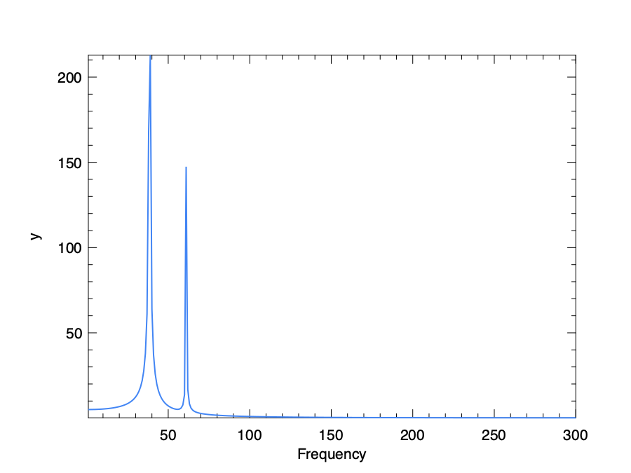
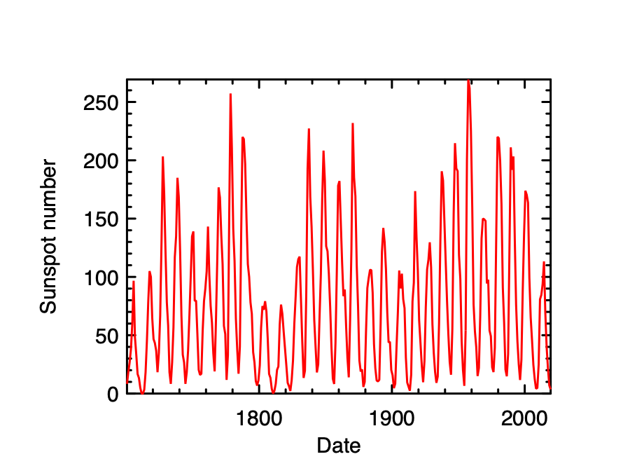
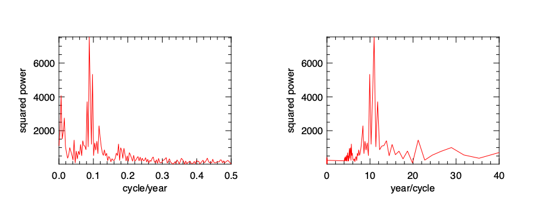
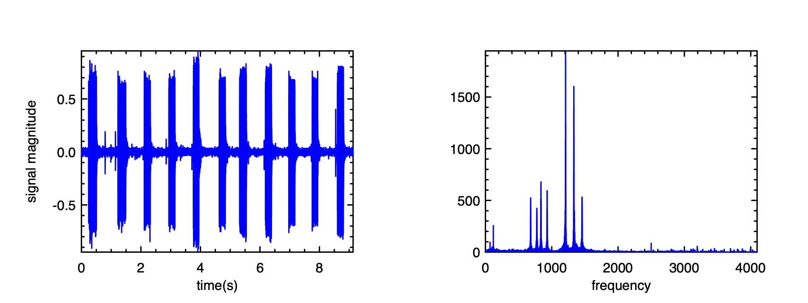
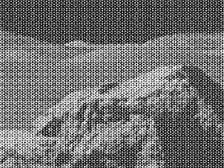
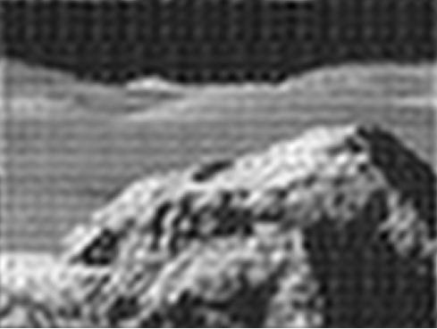
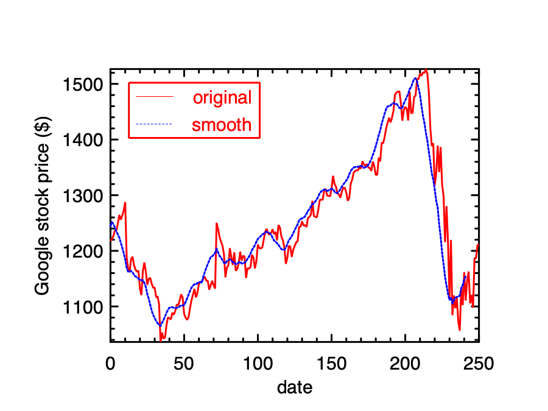
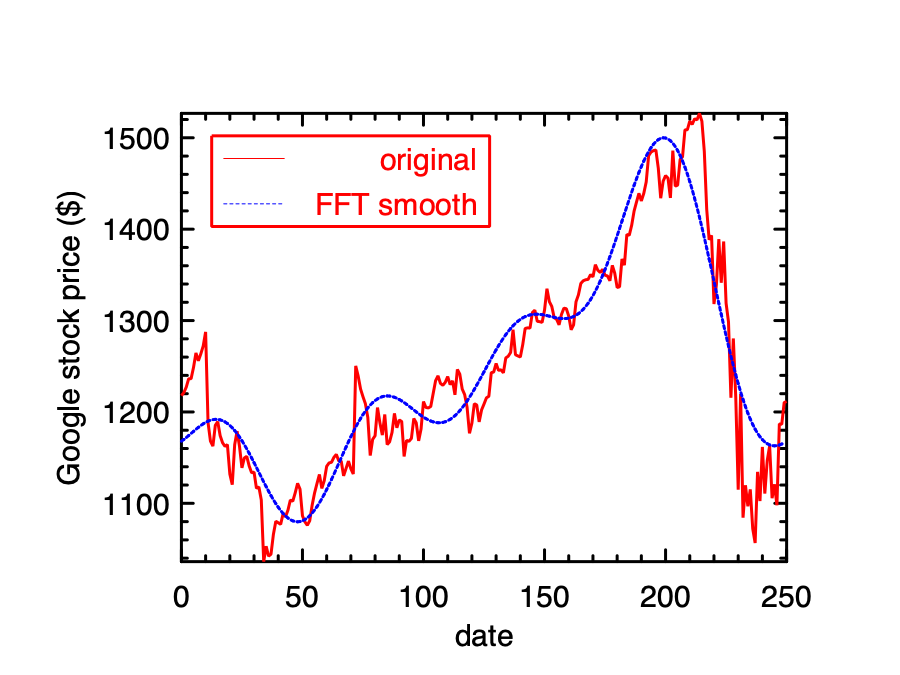

# Signal Processing

We rely on signals such as sound and images to convey information.
The signal processing is a field that's about analysing, generation, and transformation of signals.
Its applications can be seen in a wide range of fields: audio processing, speech recognition, image processing, communication system, data science, etc.
In this chapter we mainly focus on Fourier Transform, the core idea in signal processing and modern numerical computing.
We introduce its basic idea, and then demonstrate how Owl supports FFT with examples and applications.
We also cover the relationship between FFT and Convolution, and filters.

## Discrete Fourier Transform

One theme in numerical applications is the transformation of equations into a coordinate system so that the original question can be easily decoupled and simplified.
One of the most important such transformation is the *Fourier Transform*, which decomposes a function of time into its constituent frequencies.

All these sound too vague. Let's look at an example.
Think about an audio that lasts for 10 seconds.
This audio can surely be described in the *time domain*, which means plotting its sound intensity against time as x axis.
On the other hand, maybe less obviously, the sound can also be described in the *frequency domain*. For example, if all the 10 seconds are filled with only playing the A# note, then you can describe this whole audio with one frequency number: 466.16 Hz. If it's a C note, then the number is 523.25 Hz, etc.
The thing is that, the real-world sound is not always so pure, they are quite likely compounded from different frequencies. Perhaps this 10 seconds are about water flowing, or wind whispering, what frequencies it is built from then?

That's where Fourier Transform comes into play. It captures the idea of converting the two forms of representing a signal: in time domain and in frequency domain.
We can represent a signal with the values of some quantity $h$ as a function of time: $h(t)$, or this signal can be represented by giving its amplitude $H$ as function of frequency: $H(f)$. We can think they are two representation of the same thing, and Fourier Transform change between them:

$$ h(f) = \int H(f)e^{-2\pi~ift}df$$ {#eq:signal:ft01}
$$ H(f) = \int h(t)e^{2\pi~ift}dt$$

To put it simply: suppose Alice mix an unknown number of colour together, and let Bob to guess what those colours are, then Bob can use a Fourier Transform machine to do that.

In computer-based numerical computation, signals are often represented in a discrete way, i.e. a finite sequence of sampled data, instead of continuous.
In that case, the method is called *Discrete Fourier Transform* (DFT).
Suppose we have a complex vector $y$ as signal, which contains $n$ elements, then to get the Fourier Transform vector $Y$, the discrete form of [@eq:signal:ft01] can be expressed with:

$$ Y_k = \sum_{j=0}^{n-1}y_j~\omega^{jk},$$ {#eq:signal:dft01}
$$ y_k = \frac{1}{n}\sum_{j=0}^{n-1}Y_k~\omega^{-jk},$$

where $\omega = e^{-2\pi~i/n}$ and $i = \sqrt{-1}$. $j$ and $k$ are indices that go from 0 to $n-1$.

We highly recommend you to checkout the [video](https://www.youtube.com/watch?v=spUNpyF58BY) that's named "But what is the Fourier Transform? A visual introduction" produced by 3Blue1Brown.
It shows how this [@eq:signal:dft01] of Fourier Transform comes into being with beautiful and clear illustration.

What can we do if we know how a sound is composed?
Think of a classic example where you need to remove some high pitch noise from some music. By using DFT, you can easily find out the frequency of this noise, remove this frequency, and turn the signal back to the time domain by using something a reverse process.
You can also get a noisy image, recognise its noise by applying Fourier Transform, remove the noises, and reconstruct the image without noise.
We will show such examples later.

Actually, the application of FT is more than on sound or image signal processing.
We all use Fourier Transform every day without knowing it: mobile phones, image and audio compression, communication networks, large scale numerical physics and engineering, etc.
It is the cornerstone fo computational mathematics.
One important reason of its popularity is that it has an efficient algorithm in implementation: Fast Fourier Transform.

## Fast Fourier Transform

One problem with DFT is that if you follow its definition in implementation, the algorithm computation complexity would be $\mathcal{O}(n^2)$: computing each of the $n$ component of $Y$ in [@eq:signal:dft01] requires $n$ multiplications and $n$ additions.
It means that DFT does not scale well with input size.
The Fast Fourier Transform algorithm, first formulated by Gauss in 1805 and then developed by James Cooley and John Tukey in 1965, drops the complexity down to $\mathcal{O}(n\log{}n)$.
To put it in a simple way, the FFT algorithm finds out that, any DFT can be represented by the sum of two sub-DFTs: one consists of the elements on even index in the signal, and the other consists of elements on odd positions:

$$ Y_k = \sum_{even j}\omega^{jk}y_j + \sum_{odd j}\omega^{jk}y_j$$ {#eq:signal:fft01}
$$ = \sum_{j=0}^{n/2-1}\omega^{2jk}y_{2j} + \omega^k\sum_{j=0}^{n/2-1}\omega^{2jk}y_{2j+1}.$$

The key to this step is the fact that $\omega_{2n}^2 = \omega_n$.
According to [@eq:signal:fft01], one FFT can be reduced into two FFTs, each on only half of the original length, and then the second half is multiplied by a factor $\omega^{k}$ and added to the first half.
The half signal can further be halved, so on and so forth. Therefore the computation can be reduced to a logarithm level in a recursive process.
At the end of this recursion is the fact that a FFT on input that contains only one number returns just the number itself.

To introduce Fourier Transform in detailed math and analysis of its properties is beyond the scope of this book, we encourage the readers to refer to other classic textbook on this topic [@phillips2003signals].
In this chapter, we focus on introducing how to use FFT in Owl and its applications with Owl code. Hopefully these materials are enough to interest you to investigate more.

The implementation of the FFT module in Owl interfaces to the [FFTPack](https://www.netlib.org/fftpack/) C implementation.
The core functions in a FFT module is the fft function and its reverse, corresponding to the two equations in [@eq:signal:fft01].
Owl provides these basic FFT functions, listed in Tabel [@tbl:signal:fftfun].
The parameter `otyp` is used to specify the output type. It must be the consistent
precision with input `x`. You can skip this parameter by using a sub-module
with specific precision such as ``Owl.Fft.S`` or ``Owl.Fft.D``.
The `axis` parameter  is the highest dimension if not specified.
The parameter `n` specifies the size of output.

| Functions | Description
| --------- |:--------------------|
| `fft ~axis x` | Compute the one-dimensional discrete Fourier Transform |
| `ifft ~axis x` | Compute the one-dimensional inverse discrete Fourier Transform |
| `rfft ~axis otyp x` | Compute the one-dimensional discrete Fourier Transform for real input |
| `irfft ~axis ~n otyp x` | Compute the one-dimensional inverse discrete Fourier Transform for real input |
: FFT functions in Owl {#tbl:signal:fftfun}

### Examples

We then show how to use these functions with some simple examples.
More complex and interesting ones will follow in the next section.

**1-D Discrete Fourier transforms**

Let start with the most basic `fft` and it reverse transform function `ifft`.
First, we create a complex 1-D ndarray that contains 6 elements as input to the `fft` function.

```ocaml
# let a = [|1.;2.;1.;-1.;1.5;1.0|]
val a : float array = [|1.; 2.; 1.; -1.; 1.5; 1.|]
# let b = Arr.of_array a [|6|] |> Dense.Ndarray.Generic.cast_d2z
val b : (Complex.t, complex64_elt) Dense.Ndarray.Generic.t =

       C0      C1      C2       C3        C4      C5
R (1, 0i) (2, 0i) (1, 0i) (-1, 0i) (1.5, 0i) (1, 0i)

```

```ocaml
# let c = Owl_fft.D.fft b
val c : (Complex.t, complex64_elt) Owl_dense_ndarray_generic.t =

         C0                 C1                 C2                  C3                C4                C5
R (5.5, 0i) (2.25, -0.433013i) (-2.75, -1.29904i) (1.5, 1.94289E-16i) (-2.75, 1.29904i) (2.25, 0.433013i)

```

The function `fft` takes a complex ndarray as input, and also returns a complex ndarray.
In the result returned, the first half contains the positive-frequency terms, and the second half contains the negative-frequency terms, in order of decreasingly negative frequency.
The negative frequency components are the phasors rotating in opposite direction.
Typically, only the FFT corresponding to positive frequencies is used, so as to remove redundant frequencies, such as the `2.25` and `-2.75` here.

```ocaml
# let d = Owl_fft.D.ifft c
val d : (Complex.t, complex64_elt) Owl_dense_ndarray_generic.t =

                 C0                C1                 C2                  C3                  C4                C5
R (1, 1.38778E-17i) (2, 1.15186E-15i) (1, -8.65641E-17i) (-1, -1.52188E-15i) (1.5, 1.69831E-16i) (1, 2.72882E-16i)

```

The function `ifft` takes the frequency domain result `c` produced by `fft` and reconstruct the original time domain signal.
Since we do not change the frequencies, the inverse FFT should produce quite similar result as the original input, as shown in this example.

Perhaps only manipulating arrays still does not make very impressive example.
The next example plots the FFT of the sum of two sine functions, showing the power of FFT to separate signals of different frequencies.

```ocaml
# module G = Dense.Ndarray.Generic
module G = Owl.Dense.Ndarray.Generic

# let n = 600. (* sample points *)
val n : float = 600.
# let t = 1. /. 800. (* sample spacing *)
val t : float = 0.00125
# let x = Arr.linspace 0. (n *. t) (int_of_float n)
val x : Arr.arr =

  C0         C1         C2         C3         C4         C595     C596     C597     C598 C599
R  0 0.00125209 0.00250417 0.00375626 0.00500835 ... 0.744992 0.746244 0.747496 0.748748 0.75

```

```ocaml
# let y1 = Arr.((50. *. 2. *. Owl_const.pi) $* x |> sin)
val y1 : Arr.arr =

  C0       C1       C2      C3       C4         C595    C596     C597     C598        C599
R  0 0.383289 0.708033 0.92463 0.999997 ... 0.999997 0.92463 0.708033 0.383289 1.27376E-14

```

```ocaml
# let y2 = Arr.(0.5 $* ((80. *. 2. *. Owl_const.pi) $* x |> sin))
val y2 : (float, float64_elt) Owl_dense_ndarray_generic.t =

  C0       C1       C2      C3       C4          C595     C596      C597      C598         C599
R  0 0.294317 0.475851 0.47504 0.292193 ... -0.292193 -0.47504 -0.475851 -0.294317 -2.15587E-14

```

Here we create two sine signals of different frequencies: $y_1(x)=\sin(100\pi~x)$, $y_2(x) = \frac{1}{2}\sin(160\pi~x)$. We then mix them together.

```ocaml
# let y = Arr.(y1 + y2) |> G.cast_d2z
val y : (Complex.t, complex64_elt) G.t =

       C0             C1            C2            C3            C4               C595           C596           C597            C598               C599
R (0, 0i) (0.677606, 0i) (1.18388, 0i) (1.39967, 0i) (1.29219, 0i) ... (0.707804, 0i) (0.449591, 0i) (0.232182, 0i) (0.0889723, 0i) (-8.82117E-15, 0i)

```

Next, we apply FFT on the mixed signal:

```ocaml
# let yf = Owl_fft.D.fft y
val yf : (Complex.t, complex64_elt) Owl_dense_ndarray_generic.t =

             C0                    C1                    C2                    C3                  C4                     C595                 C596                   C597                   C598                   C599
R (5.01874, 0i) (5.02225, 0.0182513i) (5.03281, 0.0366004i) (5.05051, 0.0551465i) (5.0755, 0.073992i) ... (5.108, -0.0932438i) (5.0755, -0.073992i) (5.05051, -0.0551465i) (5.03281, -0.0366004i) (5.02225, -0.0182513i)

```

In the results, each tuple can be seen as a frequency vector in the complex space.
We can plot the length of these vectors.
As we have said, we use only the first half, or the positive frequencies, of array `yf`.

```ocaml
# let z = Dense.Ndarray.Z.(abs yf |> re)
val z : Dense.Ndarray.Z.cast_arr =

       C0      C1      C2      C3      C4        C595    C596    C597    C598    C599
R 5.01874 5.02228 5.03294 5.05081 5.07604 ... 5.10886 5.07604 5.05081 5.03294 5.02228

```

```ocaml
# let h = Plot.create "plot_001.png" in
  let xa = Arr.linspace 1. 600. 600 in
  Plot.plot ~h ~spec:[ RGB (66,133,244); LineWidth 2.] xa z;
  Plot.set_xrange h 1. 300.;
  Plot.set_xlabel h "Frequency";
  Plot.output h;;
- : unit = ()
```

{.align-center width=70%}

Next let's see `rfft` and `irfft`.
Function `rfft` calculates the FFT of a real signal input and generates the complex number FFT coefficients for half of the frequency domain range.
The negative part is implied by the Hermitian symmetry of the FFT.
Similarly, `irfft` performs the reverse step of `rfft`.
They are different to `fft` and `ifft` only in the data type, and may make the code cleaner sometimes, as shown in the example below.

```ocaml
# let a = [|1.; 2.; 1.; -1.; 1.5; 1.0|]
val a : float array = [|1.; 2.; 1.; -1.; 1.5; 1.|]
# let b = Arr.of_array a [|6|]
val b : Arr.arr =
  C0 C1 C2 C3  C4 C5
R  1  2  1 -1 1.5  1

```

```ocaml
# let c = Owl_fft.D.rfft b
val c : (Complex.t, complex64_elt) Owl_dense_ndarray_generic.t =

         C0                 C1                 C2        C3
R (5.5, 0i) (2.25, -0.433013i) (-2.75, -1.29904i) (1.5, 0i)

```

```ocaml
# let d = Owl_fft.D.irfft c
val d : (float, float64_elt) Owl_dense_ndarray_generic.t =

  C0 C1 C2 C3  C4 C5
R  1  2  1 -1 1.5  1

```

**N-D Discrete Fourier transforms**


The owl FFT functions also applies to multi-dimensional arrays, such as matrix.
Example: the fft matrix.

```ocaml
# let a = Dense.Matrix.Z.eye 5
val a : Dense.Matrix.Z.mat =

        C0      C1      C2      C3      C4
R0 (1, 0i) (0, 0i) (0, 0i) (0, 0i) (0, 0i)
R1 (0, 0i) (1, 0i) (0, 0i) (0, 0i) (0, 0i)
R2 (0, 0i) (0, 0i) (1, 0i) (0, 0i) (0, 0i)
R3 (0, 0i) (0, 0i) (0, 0i) (1, 0i) (0, 0i)
R4 (0, 0i) (0, 0i) (0, 0i) (0, 0i) (1, 0i)

```

```ocaml
# let b = Owl_fft.D.fft a
val b : (Complex.t, complex64_elt) Owl_dense_ndarray_generic.t =

        C0                      C1                      C2                      C3                      C4
R0 (1, 0i)                 (1, 0i)                 (1, 0i)                 (1, 0i)                 (1, 0i)
R1 (1, 0i)  (0.309017, -0.951057i) (-0.809017, -0.587785i)  (-0.809017, 0.587785i)   (0.309017, 0.951057i)
R2 (1, 0i) (-0.809017, -0.587785i)   (0.309017, 0.951057i)  (0.309017, -0.951057i)  (-0.809017, 0.587785i)
R3 (1, 0i)  (-0.809017, 0.587785i)  (0.309017, -0.951057i)   (0.309017, 0.951057i) (-0.809017, -0.587785i)
R4 (1, 0i)   (0.309017, 0.951057i)  (-0.809017, 0.587785i) (-0.809017, -0.587785i)  (0.309017, -0.951057i)

```

## Applications of FFT

As we said, the applications of FFT are numerous. Here we pick three to demonstrate the power of FFT and how to use it in Owl.
The first is to find the period rules in the historical data of sunspots, and the second is about analysing the content of dial number according to audio information.
Both applications are inspired by [@moler2008numerical].
The third application is about image processing.
These three applications together present a full picture about how the wide usage of FFT in various scenarios.

### Find period of sunspots

On the Sun's photosphere, the *sunspots* are what appear as spots darker than the surrounding areas. Their number changes according to a certain cycle.
The Sunspot Index and Long-term Solar Observations (SILS) is a world data center that preserves the data about the sunspot.
In this example, we will use the data here to find out the sunspot cycle.

The [datasets](http://sidc.oma.be/silso/newdataset) are all avaliable on the website of SILS.
Each contains the time and the sunspots number, measured by the "wolfer index".
The dataset provided here are of different granularity. Here we use the yearly data, from 1700 to 2020.
You can also try the monthly data to get more detailed knowledge.
First, load the data:

```ocaml
let data = Owl_io.read_csv ~sep:';' "sunspot_full.csv"
let data = Array.map (fun x -> Array.map float_of_string x) data |> Mat.of_arrays

let x = Mat.get_slice [[];[0]] data
let y = Mat.get_slice [[];[1]] data
```

We can then visualise the data:

```ocaml
let plot_sunspot x y =
  let h = Plot.create "plot_sunspot.png" in
  Plot.set_font_size h 8.;
  Plot.set_pen_size h 3.;
  Plot.set_xlabel h "Date";
  Plot.set_ylabel h "Sunspot number";
  Plot.plot ~h ~spec:[ RGB (255,0,0); LineStyle 1] x y;
  Plot.output h
```



We can see there is a cycle of about 10 years, but exactly how long is it? Let's start by applying the FFT on this signal.
To process the data, we first remove the first element of the frequency vector `y'`, since it stores the sum of the data.
The frequency is reduced to half, since we plot only half of the coefficients.

```ocaml
let get_frequency y =
  let y' = Owl_fft.D.rfft ~axis:0 y in
  let y' = Dense.Ndarray.Z.get_slice [[1; (Dense.Ndarray.Z.shape y').(0) - 1];[]] y' in
  Dense.Ndarray.Z.(abs y' |> re)
```

The frequency (`cycle/year`) as unit of measurement seems a bit confusing.
To get the cyclical activity that is easier to interpret, we also plot the squared power as a function of `years/cycle`.
Both are plotted with code below.

```ocaml
let plot_sunspot_freq p =
  let n = (Arr.shape p).(0) in
  let f = Arr.(mul_scalar (linspace 0. 1. n) 0.5) in

  let h = Plot.create ~m:1 ~n:2 "plot_sunspot_freq.png" in
  Plot.set_pen_size h 3.;
  Plot.subplot h 0 0;
  Plot.set_xlabel h "cycle/year";
  Plot.set_ylabel h "squared power";
  Plot.plot ~h ~spec:[ RGB (255,0,0); LineStyle 1] f p;

  Plot.subplot h 0 1;
  Plot.set_xlabel h "year/cycle";
  Plot.set_ylabel h "squared power";
  let f' = Arr.(scalar_div 1. (get_slice [[1; Stdlib.(n-1)]] f)) in
  Plot.plot ~h ~spec:[ RGB (255,0,0); LineStyle 1] f' p;
  Plot.set_xrange h 0. 40.;
  Plot.output h
```

The result is shown in [@fig:signal:freq].
Now we can see clearly that the most prominent cycle is a little bit less than 11 years.



### Decipher the Tone

When we are dialling a phone number, the soundwave can be seen a signal.
In this example, we show how to decipher which number is dialled according to the given soundwave.
This examples uses the data from [@moler2008numerical].
Let's first load and visualise them.

```
let data = Owl_io.read_csv ~sep:',' "touchtone.csv"
let data = Array.map (fun x -> Array.map float_of_string x) data |> Mat.of_arrays
let data = Mat.div_scalar data 128.
```

The dataset specifies a sampling rate of 8192.

```ocaml:tune01
let fs = 8192.
```

We have a segment of signal that shows the touch tone of dialling a phone number.
We can visualise the signal:

```ocaml:tune01
let plot_tone data filename =
  let x = Mat.div_scalar (Mat.sequential 1 (Arr.shape data).(1)) fs in
  let h = Plot.create filename in
  Plot.set_font_size h 8.;
  Plot.set_pen_size h 3.;
  Plot.set_xlabel h "time(s)";
  Plot.set_ylabel h "signal magnitude";
  Plot.plot ~h ~spec:[ RGB (0, 0, 255); LineStyle 1] x data;
  Plot.output h
```

The result is shown in [@fig:signal:tone](a).
Apparently, according to the dense area in this signal, there are 11 digits in this phone number. The question is: which numbers?



This is a suitable question for FFT.
Let's start by applying the FFT to the original data.

```
let yf = Owl_fft.D.rfft data
let y' = Dense.Ndarray.Z.(abs yf |> re)
let n = (Arr.shape y').(1)
let x' = Mat.linspace 0. (fs /. 2.) n
```

We plot `x'` with `y'` similarly using the previous plotting function, and the result is shown in [@fig:signal:tone](b).
The tune of phone is combination of two different frequencies.
All the 11 digits are composed from 7 prominent frequencies, as shown in [@tbl:signal:keypad].
This frequency keypad is specified in the Dual-tone multi-frequency signalling (DTMF) standard.

|| 1209 Hz  | 1336 Hz | 1477 Hz |
|:---------:|:-------:|:-------:|:-------:|
| **697Hz** | 1 | 2 | 3 |
| **770Hz** | 4 | 5 | 6 |
| **852Hz** | 7 | 8 | 9 |
| **941Hz** | * | 2 | # |
: DTMF keypad frequencies {#tbl:signal:keypad}

We can use the first tone as an example to find out which two frequencies it is composed from.
Let's get a subset of the signal:

```
let data2 = Arr.get_slice [[];[0; 4999]] data
```


And then perform the same process as before, the results are shown in [@fig:signal:tone2].
We can see that the first digit is mainly composed from two frequencies, which are about 700 and 1200.
Looking it up in [@tbl:signal:keypad], we can see that the first digit is `1`.
You can investigate the whole phone number following the same procedure.


### Image Processing

When the data  to be processed goes from being one dimensional to multiple dimensional, FFT is still a powerful tool.
It can be used for a wide range of image processing tasks such as blurring, compression or denosing.
In this section, we demonstrate an image denoising example.
The basic idea is similar: many Fourier frequencies in the image are small and can be neglected via using filters. The image quality can be largely preserved by recreating the image from only the major frequencies.

As input, we use the noised version of the moon landing image([src](https://imgur.com/gallery/MHcHVmX)), as shown in [@fig:signal:moonlanding].



As a tool for image processing, we use the [imageUtils.ml](https://gist.github.com/jzstark/f93177fcb0ab843e82d2c6b83880d873) script. It can be used for reading images of PPM format into ndarray, or saving ndarray into PPM image. You can copy this script to local directory.

```
#use "imageUtils.ml"
```

As the first step, we read in the image into Owl as a ndarray using the function `load_ppm`. All the elements in this matrix are within the range 0 to 255. Since this is an greyscale image, we only need to process on single channel of this array, which is a matrix.

```
module N = Dense.Ndarray.S
module C = Dense.Ndarray.C

let img_arr = load_ppm "moonlanding.ppm" |> N.get_slice [[];[];[0]]

let shp = N.shape img_arr
let h, w = shp.(0), shp.(1)
let img = N.reshape img_arr [|h; w|] |> Dense.Ndarray.Generic.cast_s2c
```

The next step is simple: applying the `fft2` function on the image.

```
let img_fft = Owl_fft.S.fft2 img
```

Next, we can apply all kinds of filters on this frequency map `img_fft` to remove the unwanted frequencies.
We choose use a simple one here: only keep the frequencies on the four "corner" in this matrix, and set the rest to zeros.  
We can achieve that with the slicing.

```
let sub_length x frac = (float_of_int x) *. frac |> int_of_float

let h1 = sub_length h 0.1
let h2 = sub_length h 0.9
let w1 = sub_length w 0.1
let w2 = sub_length w 0.9

let index_0 = [ R [h1; h2]; R []]
let index_1 = [ R [0; h1]; R [w1; w2] ]
let index_2 = [ R [h2; h-1]; R [w1; w2] ]

let slice_0 = C.get_fancy index_0 img_fft
let slice_1 = C.get_fancy index_1 img_fft
let slice_2 = C.get_fancy index_2 img_fft

let _ = C.set_fancy index_0 img_fft (C.shape slice_0 |> C.zeros)
let _ = C.set_fancy index_1 img_fft (C.shape slice_1 |> C.zeros)
let _ = C.set_fancy index_2 img_fft (C.shape slice_2 |> C.zeros)
```

Finally, let's apply the reverse FFT function on the processed frequency map, and save the result as image.

```
let img = Owl_fft.S.ifft img_fft |> C.re

let image = N.stack ~axis:2 [|img; img; img|]
let image = N.expand image 4
let _ = save_ppm_from_arr image "moonlanding_denoise.ppm"
```

As can be seen in [@fig:signal:moonlanding_denoise], though a bit blur, the output image remove the noise in the original image, and manage to keep most of the information in it.



## Filtering

In the N-dimensional Array chapter, we have introduced the idea of `filter`, which allows to get target data from the input according to some function.
*Filtering* in signal processing is similar. It is a generic name for any system that modifies input signal in certain ways, most likely removing some unwanted features from it.
In this section, we introduce how FFT can be applied to perform some filtering tasks with examples.

### Example: Smoothing

Let's start with a simple and common filter task: smoothing.
Suppose you have a segment of noisy signal: the stock price.
In many cases we hope to remove the extreme trends and see a long-term trend from the historical data.
We take the stock price of Google in the past year, April 09, from 2019 to 2020.
The data is taken from Yahoo Finance.
We can load the data into a matrix:

```ocaml
let data = Owl_io.read_csv ~sep:',' "goog.csv"
let data = Array.map (fun x ->
    Array.map float_of_string (Array.sub x 1 6))
    (Array.sub data 1 (Array.length data - 1))
    |> Mat.of_arrays
```

The data `y` contains several columns, each representing opening price, volume, high price, etc.
Here we use the daily closing price as example, which are in the fourth column.

```ocaml
let y = Mat.get_slice [[];[3]] data
```

To compute the moving average of this signal, I'll create a *window* with 10 elements.
Here we only use a simple filter which normalises each element to the same `0.1`.

```ocaml
let filter = Mat.of_array (Array.make 10 0.1 ) 1 10
```

Now, we can sliding this filter window along input signal to smooth the data step by step.

```ocaml
let y' = Mat.mapi (fun i _ ->
  let r = Mat.get_fancy [R [i; i+9]; R []] y in
  Mat.dot filter r |> Mat.sum'
) (Mat.get_slice [[0; (Arr.shape y).(0) - 10]; []] y)
```

Finally, we can plot the resulting smoothed data with the original data.

```ocaml
let plot_goog data y y' =
  let n = (Arr.shape data).(0) in
  let x = Mat.sequential n 1 in
  let h = Plot.create "plot_goog.png" in
  Plot.set_font_size h 8.;
  Plot.set_pen_size h 3.;
  Plot.set_xlabel h "date";
  Plot.set_ylabel h "Google stock price ($)";
  Plot.plot ~h ~spec:[ RGB (255,0,0); LineStyle 1] x y;
  Plot.plot ~h ~spec:[ RGB (0,0,255); LineStyle 2] x y';
  Plot.(legend_on h ~position:NorthWest [|"original"; "smooth"|]);
  Plot.output h
```



The results are shown in [@fig:signal:goog].
The blue dotted line smooths the jagged original stock price line, which represents a general trend of the price.
The sudden drop in the last month might be related with the COVID-19 pandemic.

### Gaussian Filter

However, the filter we have used is not an ideal one.
A common pattern in this line drops first, but then bounces around.
To get a smoother curve, we can change this simple filter to another one: the gaussian filter.
Instead of giving equal probability to each element in the moving window, the gaussian filter assigns probability according to the gaussian distribution: $p(x) = e^{-\frac{x^2}{2\sigma^2}}$.

The code below generates a simple 1-D gaussian filter.
Similar to the previous simple example, the filter also needs to be normalised.
For the filter window vector, its range of radius is set to truncate standard deviations.
This implementation is similar to that in [SciPy]((https://github.com/scipy/scipy/blob/master/scipy/ndimage/filters.py#L135)).

```ocaml
let gaussian_kernel sigma =
  let truncate = 4. in
  let radius = truncate *. sigma +. 0.5 |> int_of_float in
  let r = float_of_int radius in
  let x = Mat.linspace (-.r) r (2 * radius + 1) in
  let f a = Maths.exp (-0.5 *. a ** 2. /. (sigma *. sigma)) in
  let x = Mat.map f x in
  Mat.(div_scalar x (sum' x))

let filter = gaussian_kernel 3.
```

Computing the correlation between filter and the input data as before, we get a better smoothed curve in [@fig:signal:goog_gauss].


Filters can be generally categorised by their usage into time domain filters and frequency domain filters.
Time domain filters are used when the information is encoded in the shape of the signal's waveform, and can be used for tasks such as smoothing, waveform shaping, etc.
It includes filter methods such as moving average and single pole.
Frequency filters are used to divide a band of frequencies from signals, and its input information is in the form of sinusoids. It includes filter methods such as Windowed-sinc and Chebyshev.
There are many filters, each with different shape (or *impulse response*) and application scenarios, and we cannot fully cover them here.
Please refer to some classical textbooks on signal processing such as [@smith1997scientist] for more information.

### Signal Convolution

So far we have not used FFT to perform filtering yet.
What we have seen in the previous section is called *convolution*.
Formally it is mathematical operation on two functions that produces a third function expressing how the shape of one is modified by the other:

$$f(t) * g(t) = \sum_{\tau=-\infty}{\infty}f(\tau)g(t-\tau)$$ {#eq:signal:01}

In equation [@eq:signal:01], $*$ denotes the convolution operation, and you can think of $f$ as (discrete) input signal, and $g$ be filter.
Note that for computing $f(\tau)g(t-\tau)$ for each $\tau$ requires adding all product pairs.
You can see that this process is computation-heavy.
It is even more tricky for computing the convolution of two continuous signal following definition.


We have talked a lot about FFT, and here is the place we use it.
Fourier Transformation can greatly reduce the complexity of computing the convolution and filtering.
Specifically, the **Convolution Theorem** states that:

$$\textrm{DFT}(f * g) = \textrm{DFT}(f).\textrm{DFT}(g).$$ {#eq:signal:02}

To put equation [@eq:signal:02] into plain words, to get DFT of two signals' convolution, we can simply get the DFT of each signal separately and then multiply them element-wise.
Someone may also prefer to express it in this way: convolution in the time domain can be expressed in multiplication in the frequency domain. And multiplication we are very familiar with.
Once you have the $\textrm{DFT}(f * g)$, you can naturally apply the inverse transform and get $f * g$.

Let's apply the DFT approach to the previous data, and move it to the frequency domain:

```
let yf = Owl_fft.D.rfft ~axis:0 y
```

The resulting data `yf` looks like this:

```ocaml
val yf : (Complex.t, Bigarray.complex64_elt) Owl_dense_ndarray_generic.t =
                        C0
  R0          (312445, 0i)
  R1  (-2664.07, 17064.3i)
  R2  (-5272.52, 3899.16i)
  R3 (-2085.98, -3101.46i)
                       ...
R124   (23.0005, -38.841i)
R125   (153.294, 68.7544i)
```

We only keep the five most notable frequencies, and set the rest to zero.

```ocaml
let n = (Dense.Ndarray.Z.shape yf).(0)
let z = Dense.Ndarray.Z.zeros [|n-5; 1|]
let _ = Dense.Ndarray.Z.set_slice [[5;n-1];[]] yf z
```

Now, we can apply reverse FFT on this processed frequency vector and get the smoothed data:

```
let y2 = Owl_fft.D.irfft ~axis:0 yf
```

We can similarly check how the smoothing approach works in [@fig:signal:goog2].
Compared to the previous two smoothing methods, FFT generates a better curve to describe the trend of the stock price.




### FFT and Image Convolution

You might heard of the word "convolution" before, and yes you are right: convolution is also the core idea in the popular deep neural network (DNN) applications.
The convolution in DNN is often applied on ndarrays.
It is not complex: you start with an input image in the form of ndarray, and use another smaller ndarray called "kernel" to slide over the input image step by step, and at each position, an element-wise multiplication is applied, and the result is filled into corresponding position in an output ndarray.
This process can be best illustrated in [@fig:signal:conv] (inspired by the nice work by [Andrej Karpathy](https://cs231n.github.io/convolutional-networks/):


Owl has provided thorough support of convolution operations:

```
val conv1d : ?padding:padding -> (float, 'a) t -> (float, 'a) t -> int array -> (float, 'a) t

val conv2d : ?padding:padding -> (float, 'a) t -> (float, 'a) t -> int array -> (float, 'a) t

val conv3d : ?padding:padding -> (float, 'a) t -> (float, 'a) t -> int array -> (float, 'a) t
```

They corresponds to different dimension of inputs.
Besides, Owl also support other derived convolution types, including dilated convolutions, transpose convolutions, and backward convolutions etc.

It's OK if none of this makes sense to you now. We'll explain the convolution and its usage in later chapter in detail.
The point is that, if you look closely, you can find that the image convolution is only a special high dimensional case of the convolution equation: a given input signal (the image), another similar but smaller filter signal (the kernel), and the filter slides across the input signal and perform element-wise multiplication.

Therefore, we can implement the convolution with FFT and vice versa.
For example, we can use `conv1d` function in Owl to solve the previous simple smoothing problem:

```ocaml
let y3  = Arr.reshape y [|1;251;1|]
let f3  = Arr.reshape filter [|10;1;1|]
let y3' = Arr.conv1d y3 f3 [|1|]
```

If you are interested to check the result, this vector `y3'` contains the data to plot a smoothed curve.
The smoothed data would be similar to that in [@fig:signal:goog] since the calculation is the same, only with more concise code.

Also, FFT is a popular implementation method of convolution. There has been a lot of research on optimising and comparing its performance with other implementation methods such as Winograd, with practical considerations such as kernel size and implementation details of code, but we will omit these technical discussion for now.

## Summary

This chapter centres around a fundamental idea behind signal processing: the Fourier Transform.
We started with its definition, and then introduce a crucial idea behind its efficient implementation: the Fast Fourier Transform (FFT).
Owl provides support to FFT by linking to existing FFTPack library.
We showed how the FFT functions can be used in Owl, first with some simple examples, and then with three real applications: finding the frequency of sunspot events, decipher the dial tone number according to its sound, and de-noising an image.
Finally, we discussed filtering in signal process using different techniques, including simple averaging smoothing, gaussian filtering, and FFT-based filtering.
Here we also explained the relationship between the two most crucial computations in numerical applications: FFT and convolution.
More about convolution can be find in the Neural Network chapter.

