# Visualisation

Owl is an OCaml numerical library. Besides its extensive supports to matrix operations, it also has a flexible plotting module. Owl's `Plot` module is designed to help you in making fairly complicated plots with minimal coding efforts. It is built atop of [Plplot[](http://plplot.sourceforge.net/index.php) but hides its complexity from users.

The module is cross-platform since `Plplot` calls the underlying graphics device driver to plot. However, based on our experience, the [Cairo Package](https://cran.r-project.org/web/packages/Cairo/index.html) provides the best quality and most accurate figure so we recommend installing Cairo.
In fact, the examples in this tutorial are all generated by using the `Cairo PNG Driver`, but as you will see, you can have a full control over the figures and configure them in multiple ways. 

In the sections below, we will demonstrate, with examples, how the plotting module is used in Owl to assist you with multiple tasks in data visualisation and analysis. 

## Create Plots

Let's start with the standard way of creating a plot using `Plot.create` function. Here is its type definition in `Owl_plot.mli`:

```text

  val create : ?m:int -> ?n:int -> string -> handle

```

Here is an example. 

```ocaml
# let f x = Maths.sin x /. x in
  let h = Plot.create "plot_001.png" in

  Plot.set_title h "Function: f(x) = sine x / x";
  Plot.set_xlabel h "x-axis";
  Plot.set_ylabel h "y-axis";
  Plot.set_font_size h 8.;
  Plot.set_pen_size h 3.;
  Plot.plot_fun ~h f 1. 15.;

  Plot.output h
- : unit = ()
```

For any graph, we need to have a handle `h` by calling the `create` function. The type of images can be automatically inferred from the figure file name. In this case, we want to create a PNG image that plots the sine function. 
We can do that with the `plot_fun` function.
Besides, we also set the x- and y-axis labels and figure title, together with the font and line size. 
You will find that these commands are similar to those in other plotting tools such as Matplotlib.
Once you call `Plot.output`, the plot will be "sealed" and written into the final file. 
The generated figure is shown below.

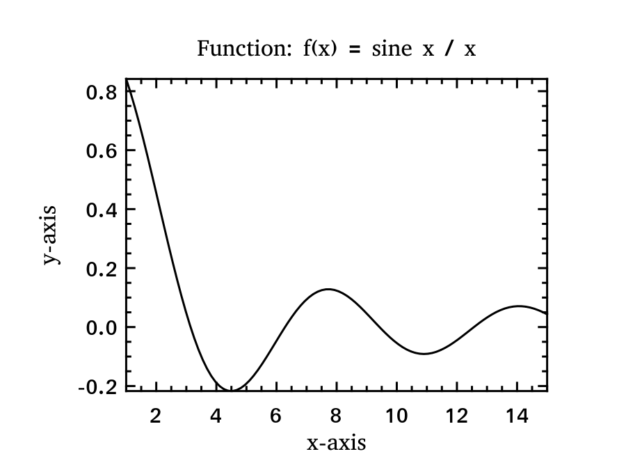{ width=70% #fig:visualisation:plot_001}

If this looks too basic for you, then we have some fancy 3-D mesh graphs in the next part. 

## Specification

For most high-level plotting functions in Owl, there is an optional parameter called `spec`. 
The `spec` parameter take a list of specifications to let you finer control the appearance of the plot. Every function has a set of slightly different parameters. 
In case you pass in some parameters that a function cannot understand, they will be simply ignored. If you pass in the same parameter for multiple times, only the last one will take effects.

In the following, we will provide some examples to show how to use the `spec` parameter to finer tune Owl's plots. The first example shows how to configure the `mesh` plot using `ZLine`, `Contour`, and other `spec` parameters.

```ocaml
# let x, y = Mat.meshgrid (-2.5) 2.5 (-2.5) 2.5 50 50 in
  let z = Mat.(sin ((x * x) + (y * y))) in
  let h = Plot.create ~m:2 ~n:3 "plot_020.png" in

  Plot.subplot h 0 0;
  Plot.(mesh ~h ~spec:[ ZLine XY ] x y z);

  Plot.subplot h 0 1;
  Plot.(mesh ~h ~spec:[ ZLine X ] x y z);

  Plot.subplot h 0 2;
  Plot.(mesh ~h ~spec:[ ZLine Y ] x y z);

  Plot.subplot h 1 0;
  Plot.(mesh ~h ~spec:[ ZLine Y; NoMagColor ] x y z);

  Plot.subplot h 1 1;
  Plot.(mesh ~h ~spec:[ ZLine Y; Contour ] x y z);

  Plot.subplot h 1 2;
  Plot.(mesh ~h ~spec:[ ZLine XY; Curtain ] x y z);

  Plot.output h
- : unit = ()
```

{ width=90% #fig:visualisation:plot_020}

The second example shows how to tune the `surf` plotting function in drawing a 3D surface. 

```ocaml
# let x, y = Mat.meshgrid (-1.) 1. (-1.) 1. 50 50 in
  let z = Mat.(tanh ((x * x) + (y * y))) in
  let h = Plot.create ~m:2 ~n:3 "plot_021.png" in

  Plot.subplot h 0 0;
  Plot.(surf ~h ~spec:[ ] x y z);

  Plot.subplot h 0 1;
  Plot.(surf ~h ~spec:[ Faceted ] x y z);

  Plot.subplot h 0 2;
  Plot.(surf ~h ~spec:[ NoMagColor ] x y z);

  Plot.subplot h 1 0;
  Plot.(surf ~h ~spec:[ Contour ] x y z);

  Plot.subplot h 1 1;
  Plot.(surf ~h ~spec:[ Curtain ] x y z);

  Plot.subplot h 1 2;
  Plot.(surf ~h ~spec:[ Altitude 10.; Azimuth 125. ] x y z);

  Plot.output h
- : unit = ()
```

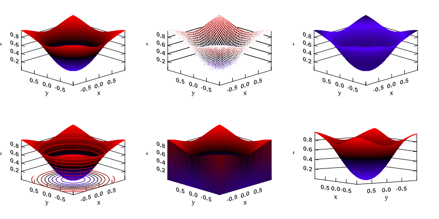{ width=90%,#fig:visualisation:plot_021 }


## Subplots

You might already have spotted another feature in the previous example: subplots. 
Indeed, you can change the number of rows and columns of the subgraph layout by varying the number of the `m` and `n` parameters in the `create` function.

```ocaml
# let f p i = match i with
    | 0 -> Stats.gaussian_rvs ~mu:0. ~sigma:0.5 +. p.(1)
    | _ -> Stats.gaussian_rvs ~mu:0. ~sigma:0.1 *. p.(0)
  in
  let y = Stats.gibbs_sampling f [|0.1;0.1|] 5_000 |> Mat.of_arrays in
  let h = Plot.create ~m:2 ~n:2 "plot_002.png" in
  Plot.set_background_color h 255 255 255;

  (* focus on the subplot at 0,0 *)
  Plot.subplot h 0 0;
  Plot.set_title h "Bivariate model";
  Plot.scatter ~h (Mat.col y 0) (Mat.col y 1);

  (* focus on the subplot at 0,1 *)
  Plot.subplot h 0 1;
  Plot.set_title h "Distribution of y";
  Plot.set_xlabel h "y";
  Plot.set_ylabel h "Frequency";
  Plot.histogram ~h ~bin:50 (Mat.col y 1);

  (* focus on the subplot at 1,0 *)
  Plot.subplot h 1 0;
  Plot.set_title h "Distribution of x";
  Plot.set_ylabel h "Frequency";
  Plot.histogram ~h ~bin:50 (Mat.col y 0);

  (* focus on the subplot at 1,1 *)
  Plot.subplot h 1 1;
  Plot.set_foreground_color h 255 0 0;
  Plot.set_title h "Sine function";
  Plot.(plot_fun ~h ~spec:[ LineStyle 2 ] Maths.sin 0. 28.);
  Plot.autocorr ~h (Mat.sequential 1 28);

  (* output your final plot *)
  Plot.output h
- : unit = ()
```

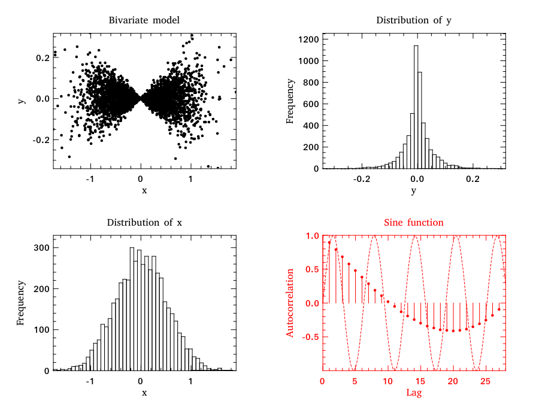{ width=90% #fig:visualisation:plot_002}


## Multiple Lines

You can certainly plot multiple lines (or other types of plots) on the same page. 
Here is one example with both sine and cosine lines in one plot.

```ocaml
# let h = Plot.create "plot_024.png" in
  Plot.(plot_fun ~h ~spec:[ RGB (0,0,255); Marker "#[0x2299]"; MarkerSize 8. ] Maths.sin 0. 9.);
  Plot.(plot_fun ~h ~spec:[ RGB (255,0,0); Marker "#[0x0394]"; MarkerSize 8. ] Maths.cos 0. 9.);
  Plot.legend_on h [|"Sine function"; "Cosine function"|];
  Plot.output h
- : unit = ()
```

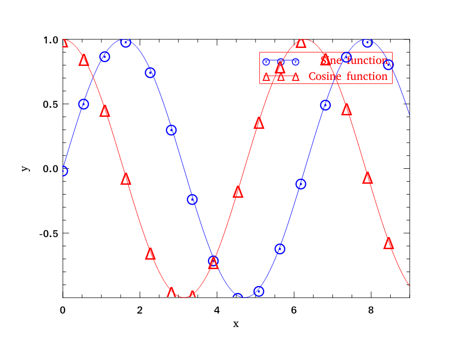{ width=70% #fig:visualisation:plot_024 }

Here is another example which has both histogram and line plot in one figure.

```ocaml
# (* generate data *)
  let g x = (Stats.gaussian_pdf x ~mu:0. ~sigma:1.) *. 100. in
  let y = Mat.gaussian ~mu:0. ~sigma:1. 1 1000 in

  (* plot multiple data sets *)
  let h = Plot.create "plot_025.png" in
  Plot.set_background_color h 255 255 255;
  Plot.(histogram ~h ~spec:[ RGB (255,0,50) ] ~bin:100 y);
  Plot.(plot_fun ~h ~spec:[ RGB (0,0,255); LineWidth 2. ] g (-4.) 4.);
  Plot.legend_on h [|"data"; "model"|];

  Plot.output h
- : unit = ()
```

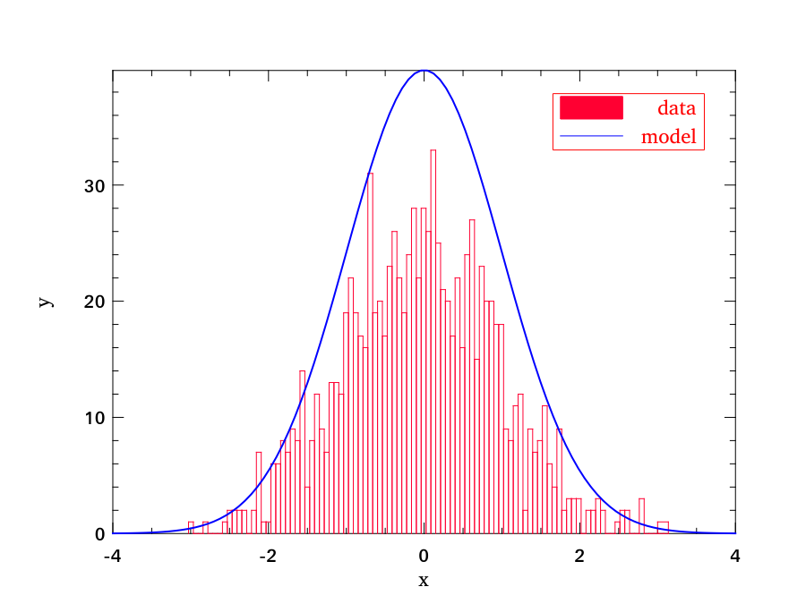{ width=90% #fig:visualisation:plot_025 }

So as long as you "hold" the plot without calling `Plot.output`, you can plot many data sets in one figure.


## Legend

Legend can be turned on and off by calling `Plot.legend_on` and `Plot.legend_off` respectively. When you call `Plot.legend_on`, you also need to provide an array of legend names and the position of legend. 
There are eight default positions in `Plot`:

```ocaml

  type legend_position =
    North | South | West | East | NorthWest | NorthEast | SouthWest | SouthEast

```

Despite of its messy looking, the following example shows how to use legend in Owl's plot module.

```ocaml
# (* generate data *)
  let x = Mat.(uniform 1 20 *$ 10.) in
  let y = Mat.(uniform 1 20) in
  let z = Mat.gaussian 1 20 in

  (* plot multiple data sets *)
  let h = Plot.create "plot_026.png" in
  Plot.(plot_fun ~h ~spec:[ RGB (0,0,255); LineStyle 1; Marker "*" ] Maths.sin 1. 8.);
  Plot.(plot_fun ~h ~spec:[ RGB (0,255,0); LineStyle 2; Marker "+" ] Maths.cos 1. 8.);
  Plot.scatter ~h x y;
  Plot.stem ~h x z;

  let u = Mat.(abs(gaussian 1 10 *$ 0.3)) in
  Plot.(bar ~h ~spec:[ RGB (255,255,0); FillPattern 3 ] u);

  let v = Mat.(neg u *$ 0.3) in
  let u = Mat.sequential 1 10 in
  Plot.(area ~h ~spec:[ RGB (0,255,0); FillPattern 4 ] u v);

  (* set up legend *)
  Plot.(legend_on h ~position:NorthEast [|"test 1"; "test 2"; "scatter"; "stem"; "bar"; "area"|]);
  Plot.output h
- : unit = ()
```

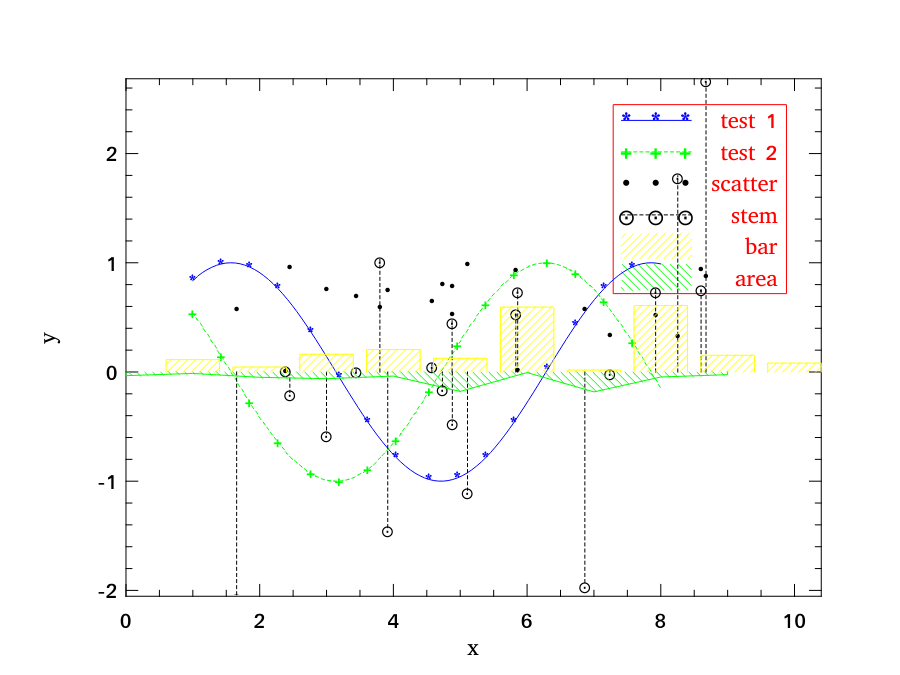{ width=90% #fig:visualisation:plot_026 }


## Drawing Patterns

The plotting module supports multiple pattern of lines, as shown below:

```ocaml
# let h = Plot.create "plot_004.png" in
  Plot.set_background_color h 255 255 255;
  Plot.set_pen_size h 2.;
  Plot.(draw_line ~h ~spec:[ LineStyle 1 ] 1. 1. 9. 1.);
  Plot.(draw_line ~h ~spec:[ LineStyle 2 ] 1. 2. 9. 2.);
  Plot.(draw_line ~h ~spec:[ LineStyle 3 ] 1. 3. 9. 3.);
  Plot.(draw_line ~h ~spec:[ LineStyle 4 ] 1. 4. 9. 4.);
  Plot.(draw_line ~h ~spec:[ LineStyle 5 ] 1. 5. 9. 5.);
  Plot.(draw_line ~h ~spec:[ LineStyle 6 ] 1. 6. 9. 6.);
  Plot.(draw_line ~h ~spec:[ LineStyle 7 ] 1. 7. 9. 7.);
  Plot.(draw_line ~h ~spec:[ LineStyle 8 ] 1. 8. 9. 8.);
  Plot.set_xrange h 0. 10.;
  Plot.set_yrange h 0. 9.;
  Plot.output h
- : unit = ()
```

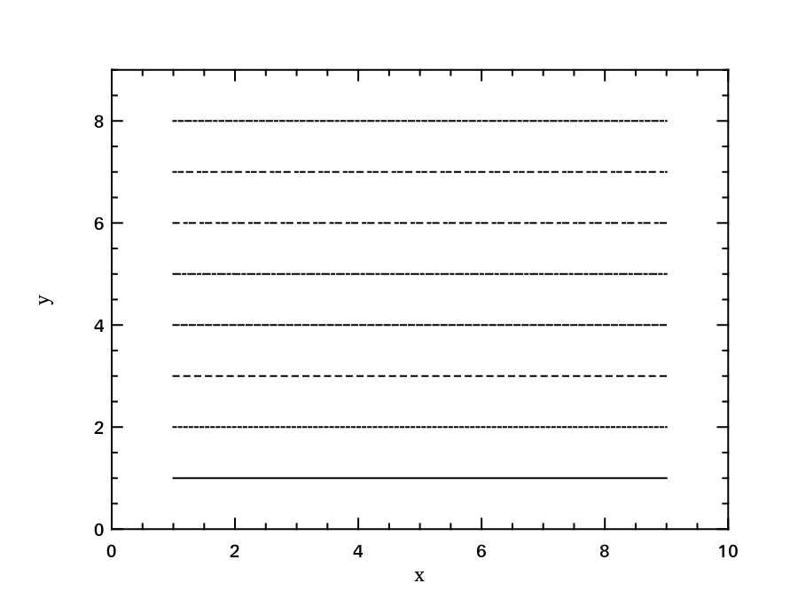{ width=90% #fig:visualisation:plot_004 }

Similarly, we can also fill rectangles with different patterns, as shown in the example below.

```ocaml
# let h = Plot.create "plot_005.png" in

  Array.init 9 (fun i ->
    let x0, y0 = 0.5, float_of_int i +. 1.0 in
    let x1, y1 = 4.5, float_of_int i +. 0.5 in
    Plot.(draw_rect ~h ~spec:[ FillPattern i ] x0 y0 x1 y1);
    Plot.(text ~h ~spec:[ RGB (0,255,0) ] 2.3 (y0-.0.2) ("pattern: " ^ (string_of_int i)))
  ) |> ignore;

  Plot.output h
- : unit = ()
```

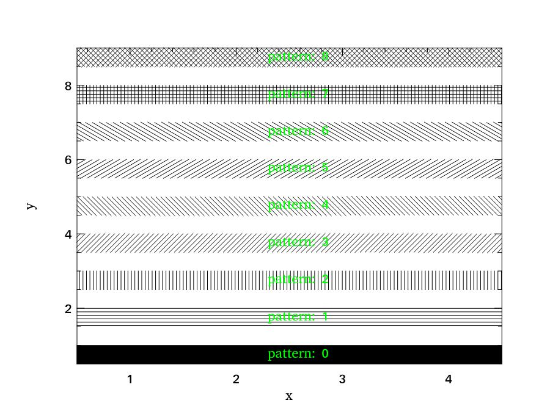{ width=90% #fig:visualisation:plot_005 }

## Line Plot

After getting to know these plotting elements, in the rest of chapter, we will demonstrate some different types of plots that are supported. 
Line plot is the most basic function. You can specify the colour, marker, and line style in the function.

```ocaml
# let x = Mat.linspace 0. 2. 100 in
  let y0 = Mat.sigmoid x in
  let y1 = Mat.map Maths.sin x in
  let h = Plot.create "plot_022.png" in
  Plot.(plot ~h ~spec:[ RGB (255,0,0); LineStyle 1; Marker "#[0x2299]"; MarkerSize 8. ] x y0);
  Plot.(plot ~h ~spec:[ RGB (0,255,0); LineStyle 2; Marker "#[0x0394]"; MarkerSize 8. ] x y1);
  Plot.(legend_on h ~position:SouthEast [|"sigmoid"; "sine"|]);
  Plot.output h
- : unit = ()
```

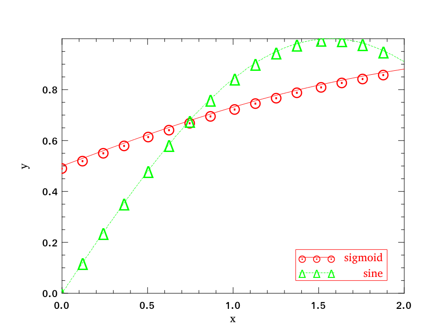{ width=90% #fig:visualisation:plot_022 }


## Scatter Plot

Next is the scatter plot. Similar to line plot, you can specify the marker type and marker size. 
The example below actually shows the various patterns of markers. They are referenced by different ids. 

```ocaml
# let x = Mat.uniform 1 30 in
  let y = Mat.uniform 1 30 in
  let h = Plot.create ~m:3 ~n:3 "plot_006.png" in
  Plot.set_background_color h 255 255 255;
  Plot.subplot h 0 0;
  Plot.(scatter ~h ~spec:[ Marker "#[0x2295]"; MarkerSize 5. ] x y);
  Plot.subplot h 0 1;
  Plot.(scatter ~h ~spec:[ Marker "#[0x229a]"; MarkerSize 5. ] x y);
  Plot.subplot h 0 2;
  Plot.(scatter ~h ~spec:[ Marker "#[0x2206]"; MarkerSize 5. ] x y);
  Plot.subplot h 1 0;
  Plot.(scatter ~h ~spec:[ Marker "#[0x229e]"; MarkerSize 5. ] x y);
  Plot.subplot h 1 1;
  Plot.(scatter ~h ~spec:[ Marker "#[0x2217]"; MarkerSize 5. ] x y);
  Plot.subplot h 1 2;
  Plot.(scatter ~h ~spec:[ Marker "#[0x2296]"; MarkerSize 5. ] x y);
  Plot.subplot h 2 0;
  Plot.(scatter ~h ~spec:[ Marker "#[0x2666]"; MarkerSize 5. ] x y);
  Plot.subplot h 2 1;
  Plot.(scatter ~h ~spec:[ Marker "#[0x22a1]"; MarkerSize 5. ] x y);
  Plot.subplot h 2 2;
  Plot.(scatter ~h ~spec:[ Marker "#[0x22b9]"; MarkerSize 5. ] x y);
  Plot.output h
- : unit = ()
```

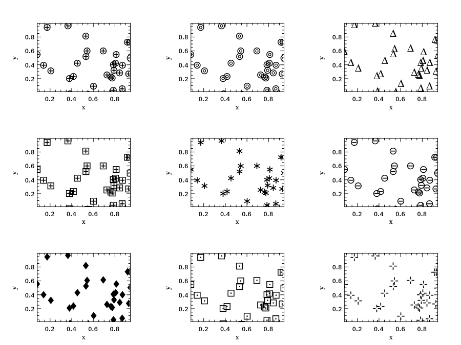{ width=90% #fig:visualisation:plot_006 }


## Stairs Plot

The step plot is also called "stairstep plot", since it draws the elements in a given ndarray in a stairstep-like curve. 

```ocaml
# let x = Mat.linspace 0. 6.5 20 in
  let y = Mat.map Maths.sin x in
  let h = Plot.create ~m:1 ~n:2 "plot_007.png" in
  Plot.set_background_color h 255 255 255;
  Plot.subplot h 0 0;
  Plot.plot_fun ~h Maths.sin 0. 6.5;
  Plot.(stairs ~h ~spec:[ RGB (0,128,255) ] x y);
  Plot.subplot h 0 1;
  Plot.(plot ~h ~spec:[ RGB (0,0,0) ] x y);
  Plot.(stairs ~h ~spec:[ RGB (0,128,255) ] x y);
  Plot.output h
- : unit = ()
```

{ width=90% #fig:visualisation:plot_007 }


## Box Plot

A box plot graphically shows groups of numerical data through their quartiles. It is often used in descriptive statistics. 

```ocaml
# let y1 = Mat.uniform 1 10 in
  let y2 = Mat.uniform 10 100 in
  let h = Plot.create ~m:1 ~n:2 "plot_008.png" in
  Plot.subplot h 0 0;
  Plot.(bar ~h ~spec:[ RGB (0,153,51); FillPattern 3 ] y1);
  Plot.subplot h 0 1;
  Plot.(boxplot ~h ~spec:[ RGB (0,153,51) ] y2);
  Plot.output h
- : unit = ()
```

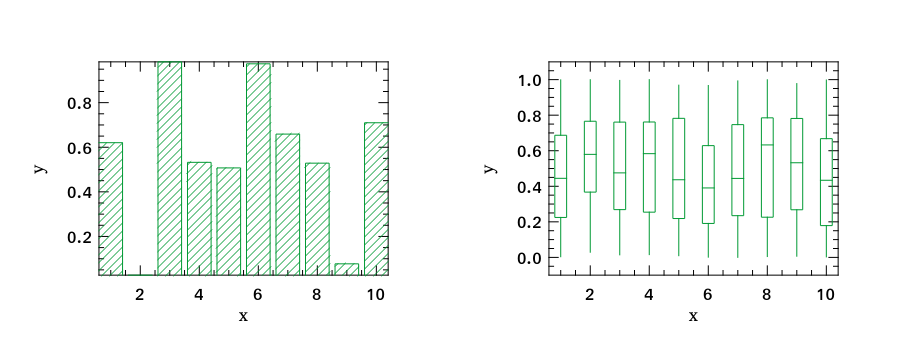{ width=90% #fig:visualisation:plot_008 }


## Stem Plot

Stem plot is simple, as the following code shows.

```ocaml
# let x = Mat.linspace 0.5 2.5 25 in
  let y = Mat.map (Stats.exponential_pdf ~lambda:0.1) x in
  let h = Plot.create ~m:1 ~n:2 "plot_009.png" in
  Plot.set_background_color h 255 255 255;
  Plot.subplot h 0 0;
  Plot.set_foreground_color h 0 0 0;
  Plot.stem ~h x y;
  Plot.subplot h 0 1;
  Plot.(stem ~h ~spec:[ Marker "#[0x2295]"; MarkerSize 5.; LineStyle 1 ] x y);
  Plot.output h
- : unit = ()
```

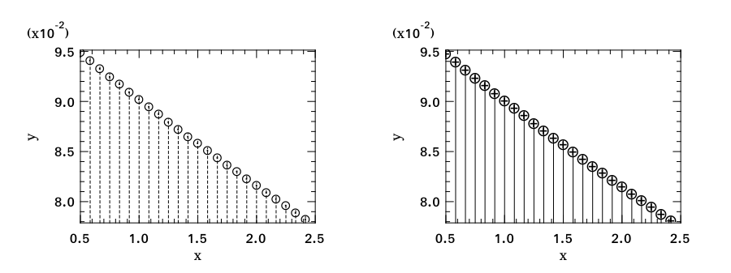{ width=90% #fig:visualisation:plot_009 }

Stem plot is often used to show the autocorrelation of a variable, therefore Plot module already includes `autocorr` for your convenience.

```ocaml
# let x = Mat.linspace 0. 8. 30 in
  let y0 = Mat.map Maths.sin x in
  let y1 = Mat.uniform 1 30 in
  let h = Plot.create ~m:1 ~n:2 "plot_010.png" in
  Plot.subplot h 0 0;
  Plot.set_title h "Sine";
  Plot.autocorr ~h y0;
  Plot.subplot h 0 1;
  Plot.set_title h "Gaussian";
  Plot.autocorr ~h y1;
  Plot.output h
- : unit = ()
```

{ width=90% #fig:visualisation:plot_010 }


## Area Plot

Area plot is similar to the line plot, but it fills the space between the line and x-axis, as shown below.

```ocaml
# let x = Mat.linspace 0. 8. 100 in
  let y = Mat.map Maths.atan x in
  let h = Plot.create ~m:1 ~n:2 "plot_011.png" in
  Plot.subplot h 0 0;
  Plot.(area ~h ~spec:[ FillPattern 1 ] x y);
  let x = Mat.linspace 0. (2. *. 3.1416) 100 in
  let y = Mat.map Maths.sin x in
  Plot.subplot h 0 1;
  Plot.(area ~h ~spec:[ FillPattern 2 ] x y);
  Plot.output h
- : unit = ()
```

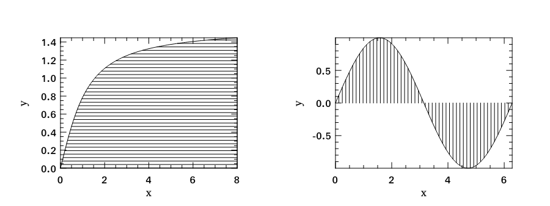{ width=90% #fig:visualisation:plot_011 }


## Histogram & CDF Plot

Histogram is one of the most commonly used plot in data visualisation.
Given a series of measurements, you can easily plot the histogram and empirical cumulative distribution of the data by using the `histogram` and `ecdf` plotting functions.

```ocaml
# let x = Mat.gaussian 200 1 in
  let h = Plot.create ~m:1 ~n:2 "plot_012.png" in
  Plot.subplot h 0 0;
  Plot.set_title h "histogram";
  Plot.histogram ~h ~bin:25 x;
  Plot.subplot h 0 1;
  Plot.set_title h "empirical cdf";
  Plot.ecdf ~h x;
  Plot.output h
- : unit = ()
```

{ width=90% #fig:visualisation:plot_012 }

## Log Plot

In the Owl plots, you can choose to use the log-scale on either or both x and y axis.

```ocaml
# let x = Mat.logspace (-1.5) 2. 50 in
  let y = Mat.map Maths.exp x in
  let h = Plot.create ~m:2 ~n:2 "plot_013.png" in

  Plot.subplot h 0 0;
  Plot.set_xlabel h "Input Data X";
  Plot.set_ylabel h "Input Data Y";
  Plot.(loglog ~h ~spec:[ RGB (0,255,0); LineStyle 2; Marker "+" ] ~x:x y);

  Plot.subplot h 0 1;
  Plot.set_xlabel h "Index of Input Data Y";
  Plot.set_ylabel h "Input Data Y";
  Plot.(loglog ~h ~spec:[ RGB (0,0,255); LineStyle 1; Marker "*" ] y);

  Plot.subplot h 1 0;
  Plot.set_xlabel h "Input Data X";
  Plot.set_ylabel h "Input Data Y";
  Plot.semilogx ~h ~x:x y;

  Plot.subplot h 1 1;
  Plot.set_xlabel h "Index of Input Data Y";
  Plot.set_ylabel h "Input Data Y";
  Plot.semilogy ~h y;

  Plot.output h
- : unit = ()
```

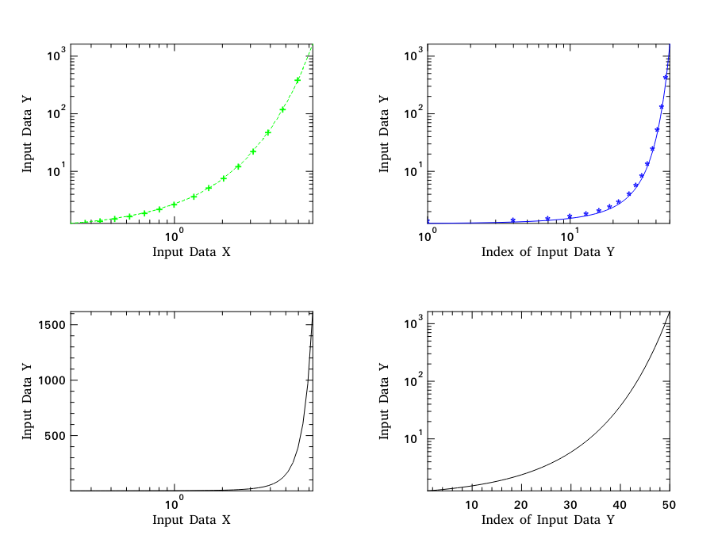{ width=90% #fig:visualisation:plot_013 }


## 3D Plot

We have seen examples of 3D plots above.
There are four functions in `Plot` module related to 3D plot. They are `surf`, `mesh`, `heatmap`, and `contour` functions. 
First, let's look at `mesh` and `surf` functions.

```ocaml
# let x, y = Mat.meshgrid (-2.5) 2.5 (-2.5) 2.5 100 100 in
  let z0 = Mat.(sin ((x **$ 2.) + (y **$ 2.))) in
  let z1 = Mat.(cos ((x **$ 2.) + (y **$ 2.))) in
  let h = Plot.create ~m:2 ~n:2 "plot_014.png" in
  Plot.subplot h 0 0;
  Plot.surf ~h x y z0;
  Plot.subplot h 0 1;
  Plot.mesh ~h x y z0;
  Plot.subplot h 1 0;
  Plot.surf ~h x y z1;
  Plot.subplot h 1 1;
  Plot.mesh ~h x y z1;
  Plot.output h
- : unit = ()
```

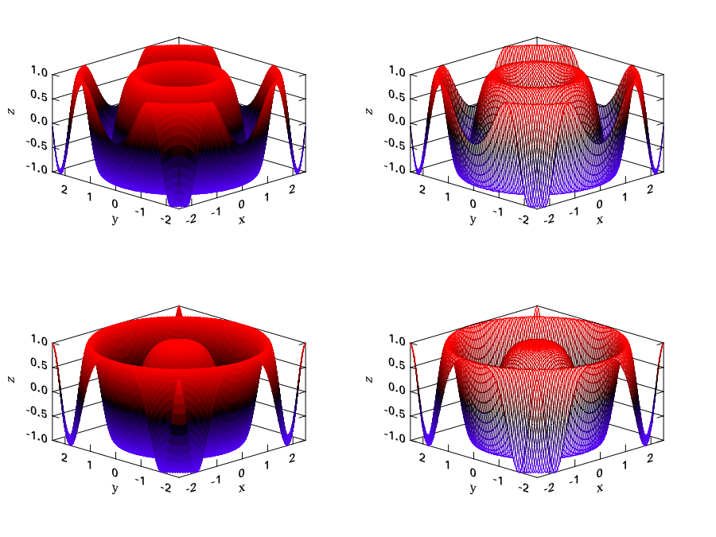{ width=90% #fig:visualisation:plot_014 }

It is easy to control the viewpoint with `altitude` and `azimuth` parameters. Here is an example.

```ocaml
# let x, y = Mat.meshgrid (-2.5) 2.5 (-2.5) 2.5 100 100 in
  let z = Mat.(sin ((x * x) + (y * y))) in
  let h = Plot.create ~m:1 ~n:3 "plot_015.png" in
  Plot.subplot h 0 0;
  Plot.(mesh ~h ~spec:[ Altitude 50.; Azimuth 120. ] x y z);
  Plot.subplot h 0 1;
  Plot.(mesh ~h ~spec:[ Altitude 65.; Azimuth 120. ] x y z);
  Plot.subplot h 0 2;
  Plot.(mesh ~h ~spec:[ Altitude 80.; Azimuth 120. ] x y z);
  Plot.output h
- : unit = ()
```

The generated figure is shown as below.

{ width=90% #fig:visualisation:plot_015 }

Here is another similar example with different functions.

```ocaml
# let x, y = Mat.meshgrid (-3.) 3. (-3.) 3. 50 50 in
  let z = Mat.(
    3. $* ((1. $- x) **$ 2.) * exp (neg (x **$ 2.) - ((y +$ 1.) **$ 2.)) -
    (10. $* (x /$ 5. - (x **$ 3.) - (y **$ 5.)) * (exp (neg (x **$ 2.) - (y **$ 2.)))) -
    ((1./.3.) $* exp (neg ((x +$ 1.) **$ 2.) - (y **$ 2.)))
    )
  in

  let h = Plot.create ~m:2 ~n:3 "plot_016.png" in
  Plot.subplot h 0 0;
  Plot.surf ~h x y z;
  Plot.subplot h 0 1;
  Plot.mesh ~h x y z;
  Plot.subplot h 0 2;
  Plot.(surf ~h ~spec:[ Contour ] x y z);
  Plot.subplot h 1 0;
  Plot.(mesh ~h ~spec:[ Contour; Azimuth 115.; NoMagColor ] x y z);
  Plot.subplot h 1 1;
  Plot.(mesh ~h ~spec:[ Azimuth 115.; ZLine X; NoMagColor; RGB (61,129,255) ] x y z);
  Plot.subplot h 1 2;
  Plot.(mesh ~h ~spec:[ Azimuth 115.; ZLine Y; NoMagColor; RGB (130,255,40) ] x y z);
  Plot.output h
- : unit = ()
```

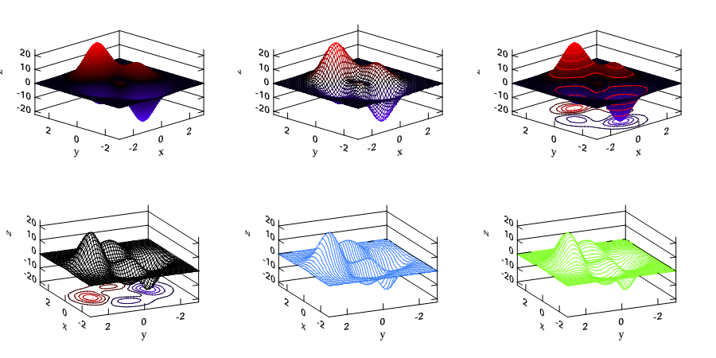{ width=90% #fig:visualisation:plot_016 }


Finally, let's look at how heatmap and contour plot look like, using the same function as before.

```ocaml
# let x, y = Mat.meshgrid (-3.) 3. (-3.) 3. 100 100 in
  let z = Mat.(
    3. $* ((1. $- x) **$ 2.) * exp (neg (x **$ 2.) - ((y +$ 1.) **$ 2.)) -
    (10. $* (x /$ 5. - (x **$ 3.) - (y **$ 5.)) * (exp (neg (x **$ 2.) - (y **$ 2.)))) -
    ((1./.3.) $* exp (neg ((x +$ 1.) **$ 2.) - (y **$ 2.)))
    )
  in

  let h = Plot.create ~m:2 ~n:2 "plot_017.png" in
  Plot.subplot h 0 0;
  Plot.(mesh ~h ~spec:[ Contour ] x y z);
  Plot.subplot h 0 1;
  Plot.heatmap ~h x y z;
  Plot.subplot h 1 0;
  Plot.mesh ~h x y z;
  Plot.subplot h 1 1;
  Plot.contour ~h x y z;
  Plot.output h
- : unit = ()
```

{ width=90% #fig:visualisation:plot_017 }


## Advanced Statistical Plot

Besides these commonly used basic plot types, we also support several advanced statistical plots. 
For example, both the `qqplot` and `probplot` are simple graphical tests for determining if a data set comes from a certain distribution.

A `qqplot` displays a quantile-quantile plot of the quantiles of the sample data y versus the theoretical quantiles values from a given distribution, or the quantiles of the sample data x. Here is an example.

```ocaml
# let y = Mat.(gaussian 100 1 *$ 10.) in
  let x = Mat.gaussian 200 1 in
  let h = Plot.create ~m:2 ~n:2 "plot_018.png" in

  Plot.subplot h 0 0;
  Plot.set_title h "Gaussian vs. Gaussian Sample";
  Plot.set_ylabel h "Quantiles of Input Sample";
  Plot.set_xlabel h "Normal Distribution Quantiles";
  Plot.qqplot ~h y ~x:x;

  Plot.subplot h 0 1;
  Plot.set_title h "Gaussian vs. Default Dist";
  Plot.set_ylabel h "Quantiles of Input Sample";
  Plot.set_xlabel h "Normal Distribution Quantiles";
  Plot.(qqplot ~h y ~spec:[RGB (0,128,255)]);

  Plot.subplot h 1 0;
  Plot.set_title h "Gaussian vs. Rayleigh Dist";
  Plot.set_ylabel h "Quantiles of Input Sample";
  Plot.set_xlabel h "Rayleigh Distribution (sigma=0.5) Quantiles";
  Plot.qqplot ~h y ~pd:(fun p -> Stats.rayleigh_ppf p 0.5);

  Plot.subplot h 1 1;
  Plot.set_title h "Gaussian vs. Chi-Square Dist";
  Plot.set_ylabel h "Quantiles of Input Sample";
  Plot.set_xlabel h "Chi-Square Distribution (k=10) Quantiles";
  Plot.qqplot ~h y ~pd:(fun p -> Stats.chi2_ppf p 10.);

  Plot.output h
- : unit = ()
```

{ width=90% #fig:visualisation:plot_018 }

The `probplot` is similar to `qqplot`. It contains two special cases: `normplot` for when the given theoretical distribution is Normal distribution, and `wblplot` for Weibull Distribution. Here is an example of them.

```ocaml
# let x = Mat.empty 200 1 |> Mat.map (fun _ -> Stats.weibull_rvs 1.2 1.5) in
  let h = Plot.create ~m:1 ~n:2 "plot_019.png" in

  Plot.subplot h 0 0;
  Plot.set_title h "Random Weibull Sample vs. Std Normal Dist";
  Plot.set_xlabel h "Sample Data";
  Plot.set_ylabel h "Theoretical Normal Dist";
  Plot.normplot ~h x;

  Plot.subplot h 0 1;
  Plot.set_title h "Random Weibull Sample vs. Weibull Dist";
  Plot.set_xlabel h "Sample Data";
  Plot.set_ylabel h "Theoretical Weibull Dist";
  Plot.wblplot ~h ~lambda:1.2 ~k:1.5 x;
  Plot.output h
- : unit = ()
```

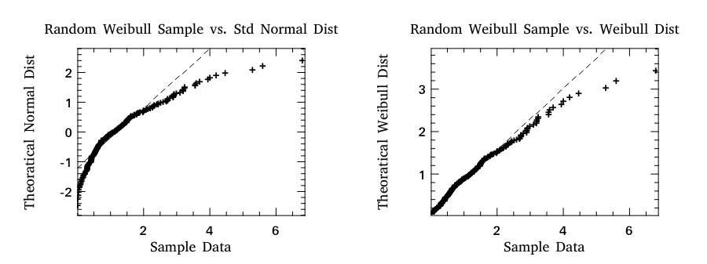{ width=90% #fig:visualisation:plot_019 }

## Summary

This chapter demonstrate the plotting module in Owl, including how to create, manipulate plots, to the different types of plots that are supported. 
This chapter provides a lot of examples. 
It aims to be a manual that you can keep going back to check when you need visualisation in your task. 
In fact, most of the plots in this book are based on this module. 

One pitfall in this chapter is that, we may not have given too much consideration about the "color harmony".
The default choice of colour may not always be pleasing to your eyes.
The good news is that, you can easily change the colors in the plot. 
Try google "colour theory" and you can find a lot of guidelines. 
For example, the analogous colours can be a good choice in your line plots. These colours are any sequential three colors on a 12-part color wheel, such as yellow-green, yellow, and yellow-orange.
We find this artistic aspect of visualisation is often enjoyable.

## References
